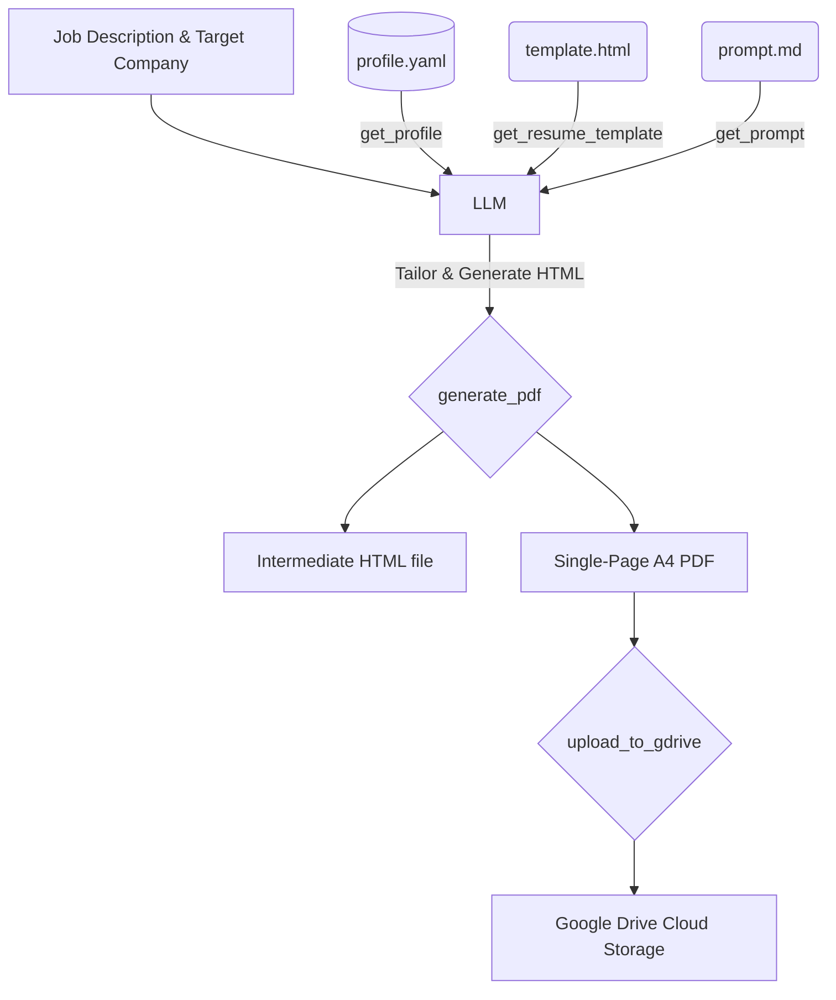

# ATS Resume Builder — MCP Server

An ATS-optimized, layout-controlled resume generator that exposes a local Model Context Protocol (MCP) server. It allows AI models (in IDEs like Cursor or Claude Desktop) to retrieve structured candidate data, read strict ATS formatting guidelines, combine them with target job descriptions, and compile the final output into a single-page, print-ready A4 PDF.

---

## 🚀 How it Works



1. **Information Retrieval**: The AI model queries the candidate's structured database (`get_profile`), the CSS-defined template layout (`get_resume_template`), and the ATS resume formatting prompt (`get_prompt`).
2. **Context-Aware Tailoring**: The AI model analyzes the target Job Description (JD) and company name, filtering out irrelevant items and mapping candidate skills/experience to JD terms.
3. **HTML Generation**: The AI model constructs a tailored resume body using strictly allowed HTML tags and class/ID styles.
4. **PDF Rendering**: The HTML is sent to the `generate_pdf` tool, which launches a headless Chromium instance via Playwright to print the page layout to an exact A4 PDF.

---

## 📁 Repository Structure

```
├── README.md              # Project documentation
├── pyproject.toml         # Python project metadata, script endpoints, & dependencies
├── profile.yaml           # Master career database (personal info, experience, education, etc.)
├── template.html          # Base layout template containing CSS variables and print margins
├── prompt.md              # System prompt guiding the LLM on keyword optimization & ATS rules
├── index.py               # Simple placeholder entry point
├── src/
│   └── ats_mcp/
│       ├── __init__.py
│       ├── models.py      # Pydantic schemas validating profile.yaml
│       ├── profile.py     # Loader utility for profile.yaml
│       ├── renderer.py    # Merges LLM HTML body with template CSS styles
│       ├── pdf.py         # Playwright utility for rendering HTML -> A4 PDF
│       ├── gdrive.py      # Google Drive upload integration (Service Account & OAuth)
│       └── server.py      # FastMCP server and tool definitions
└── output/                # Generated HTML and PDF resumes (default target)
```

---

## ⚙️ Installation & Setup

### Prerequisites
- **Python**: `>= 3.13`
- **uv** (Recommended package manager) or **pip**

### 1. Install Dependencies
Run the following command in the project root to install dependencies (including `fastmcp`, `pydantic`, `pyyaml`, and `playwright`):

```bash
# Using uv (recommended)
uv sync

# Or using standard pip
pip install .
```

### 2. Install Playwright Browsers
Since `generate_pdf` compiles resumes using Chromium, you must download the browser binaries:

```bash
# Using uv
uv run playwright install chromium

# Or using standard pip environment
playwright install chromium
```

---

## 🛠️ MCP Integration Configs

You can run this server using `uv run ats-resume-builder` or `python -m ats_mcp.server`. To use it with your favorite AI tools, add the server to your configuration.

### Claude Desktop
Add the following block to your `claude_desktop_config.json` (typically located at `~/Library/Application Support/Claude/claude_desktop_config.json` on macOS):

```json
{
  "mcpServers": {
    "ats-resume-builder": {
      "command": "uv",
      "args": [
        "--directory",
        "/path/to/your/ats-repository",
        "run",
        "ats-resume-builder"
      ],
      "env": {
        "ATS_PROFILE_PATH": "/absolute/path/to/your/profile.yaml",
        "ATS_OUTPUT_DIR": "/absolute/path/to/your/local/output-directory",
        "GDRIVE_SERVICE_ACCOUNT_JSON": "your-raw-service-account-json-string-here",
        "GDRIVE_FOLDER_ID": "your-folder-id-here"
      }
    }
  }
}
```
*Make sure to replace `/path/to/your/ats-repository` with the absolute path of the directory.*

### Cursor
1. Go to **Settings** -> **Features** -> **MCP**.
2. Click **+ Add New MCP Server**.
3. Fill out the fields:
   - **Name**: `ats-resume-builder`
   - **Type**: `command`
   - **Command**: `ATS_PROFILE_PATH="/absolute/path/to/your/profile.yaml" ATS_OUTPUT_DIR="/absolute/path/to/your/local/output-directory" uv --directory "/path/to/your/ats-repository" run ats-resume-builder`
4. Click **Save**.

---

## 🧰 MCP Tool Specifications

The server registers four tools via `FastMCP`:

### 1. `get_profile`
* **Description**: Returns the candidate's career data parsed from `profile.yaml`.
* **Returns**: A JSON object matching the `Profile` model schema.
* **Usage**: Used by the LLM to inspect contact details, skills, experiences, and achievements.
* **Environment Variables**:
  * `ATS_PROFILE_PATH`: Custom path to the candidate's `profile.yaml` file. Defaults to `<project_root>/profile.yaml`.

### 2. `get_resume_template`
* **Description**: Returns the contents of `template.html`.
* **Returns**: `str` (HTML/CSS layout).
* **Usage**: Provides the blueprint (class names, font stacks, layout constraints) that the generated HTML must conform to.

### 3. `get_prompt`
* **Description**: Returns the text contents of `prompt.md`.
* **Returns**: `str` (Markdown rules list).
* **Usage**: Informs the LLM about ATS-specific constraints, required formatting headers, vocabulary/cliché filters, and page-fitting strategies.

### 4. `generate_pdf`
* **Description**: Converts raw or structured HTML into a physical A4 PDF.
* **Arguments**:
  * `resume_html` (`str`): The finished resume HTML (body-only or complete document).
  * `company_name` (`str`): Target company name (used to slugify the output filename).
* **Returns**: `str` (Absolute file path of the compiled PDF).
* **Behavior**: Saves both an intermediate `.html` file (for styling inspects) and the compiled `.pdf` file in the configured output directory (defaults to `<project_root>/output/`).
* **Environment Variables**:
  * `ATS_OUTPUT_DIR`: Set this variable to custom-route where files should compile.

### 5. `upload_to_gdrive`
* **Description**: Uploads a generated PDF resume (or any other file) to Google Drive.
* **Arguments**:
  * `file_path` (`str`): Absolute local path to the file to be uploaded.
  * `folder_id` (`str`, optional): Google Drive folder ID. Overrides `GDRIVE_FOLDER_ID` if specified.
* **Returns**: `str` (Status message with File Name, ID, and Web View Link).

---

## 🔑 Google Drive API Authentication Setup

Since this MCP server is design-ready for public distribution, it supports three modes of authentication to upload files. These must be set as environment variables in your runtime (e.g. Claude Desktop configuration or Cursor settings):

### Option A: Service Account JSON String (Recommended for Servers/CI)
Create a Google Cloud Service Account, grant it Google Drive API permissions, download the JSON key file, and set the full raw JSON text in a single environment variable:
* **`GDRIVE_SERVICE_ACCOUNT_JSON`**: The raw JSON contents of the key file (e.g. `{"type": "service_account", ...}`).
* **Important**: Since a Service Account has its own isolated Drive, you must share your target personal Google Drive destination folder with the Service Account email address (found inside the JSON key) and specify the folder ID.

### Option B: Service Account JSON File Path
If you prefer referencing a key file path directly:
* **`GDRIVE_SERVICE_ACCOUNT_FILE`**: Path to the downloaded service account key JSON file on the local machine (e.g. `/Users/username/.secrets/gdrive-key.json`).

### Option C: OAuth 2.0 Credentials (Recommended for Personal Use)
Authenticate directly as your own user account (to write directly to your own Google Drive):
* **`GDRIVE_CLIENT_ID`**: OAuth 2.0 Client ID.
* **`GDRIVE_CLIENT_SECRET`**: OAuth 2.0 Client Secret.
* **`GDRIVE_REFRESH_TOKEN`**: A valid OAuth 2.0 Refresh Token.

### Optional Config
* **`GDRIVE_FOLDER_ID`**: The unique folder ID in Google Drive (found in the folder's URL) where files should be uploaded by default. If not set, files are uploaded to the root directory.

---

## 📝 Customizing Candidate Data

The candidate profile is stored in `profile.yaml`.

> [!IMPORTANT]
> For privacy, `profile.yaml` is excluded from git so you do not accidentally publish your personal info. 
> To set it up, copy the template file `profile.example.yaml` to `profile.yaml` and replace the placeholder data with your real career information:
> ```bash
> cp profile.example.yaml profile.yaml
> ```

The schema is strictly validated by Pydantic models in `src/ats_mcp/models.py`.

### Experience Key-Point Compression
Rather than writing verbose sentences in the configuration, experience bullets inside `profile.yaml` are structured as high-level data points:

```yaml
- action: "built centralized observability platform"
  tech: [Kafka, ClickHouse, Grafana, S3]
  replaced: "CloudWatch"
  metrics:
    scale: "350M+ logs/day"
    cost_before: "~$11K/month"
    cost_after: "~$220/month"
    reduction: "50x"
  outcome: "long-term log retention, production-scale analytics"
```

During resume generation, the LLM expands this structure into a cohesive **CAR (Context, Action, Result)** sentence, e.g.:
> *"Built a centralized observability platform using **Kafka**, **ClickHouse**, **Grafana**, and **S3** to replace CloudWatch, processing **350M+ logs/day** and reducing logging costs **50x** (from ~$11K to ~$220/month)."*

### Education and Achievements
Ensure any education GPA scale matches the grading scale of your institution (e.g. `9.11 / 10.00` or `3.8 / 4.0`). Publications can include DOI or links, which will be generated as standard HTML hyperlink anchors in the output resume.
